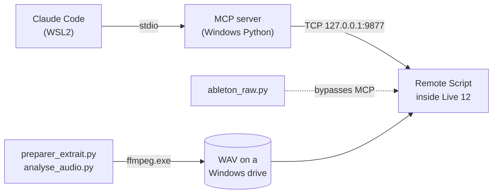

# live-sidekick

**Drive Ableton Live 12 from Claude Code — and know exactly what the Live API really does.**

A field-tested toolkit for controlling Ableton Live from an AI agent running in WSL2,
built around an [MCP](https://modelcontextprotocol.io) server. It ships the glue that
makes the WSL → Windows → Live chain reliable, sample-accurate audio tooling, and a
**measured** map of the Live Object Model: which calls work, and which ones
answer `success` while doing nothing.



## Why

Live's Python API is undocumented, changes between versions, and fails **silently**.
Every row below was measured on Live 12.4.3, not read in a forum:

| You would expect | What Live actually does |
|---|---|
| Setting `end_marker` trims an arrangement clip | Accepted, read back, **length unchanged** |
| Setting `start_marker` trims the start | **Silently reset to 0.0** |
| `start_time` moves a clip | **Read-only** — arrangement clips cannot be moved |
| Clip fades are scriptable | `fade_in_length` / `fade_out_length` **do not exist** |
| Automation can be written on arrangement clips | Refused: *"Not a session clip"* |
| An imported file plays at its own length | Live **warps** it: 15.000 s becomes 16.000 s (**+6.1 %**) |
| An mp3 starts at the same point in Live and ffmpeg | **84.6 ms apart** — the LAME priming silence |
| A property read right after a write is fresh | Extent properties are **stale until the next tick** |
| There is an export / render API | **None.** Rendering stays manual (Ctrl+Shift+R) |

The consequence shapes the whole toolkit: **Live assembles, it does not edit.**
Extracts must arrive already cut and already faded, as WAV, and be placed with
`warp=False`.

## What's inside

| Tool | What it does |
|---|---|
| `check_ableton.sh` | Tests the four stages of the chain separately, so a failure in Live does not look like a failure in WSL |
| `ableton_raw.py` | Talks to the Remote Script directly. Tells you whether a bug lives in the MCP server or in Live, and reaches parameters that tool signatures do not expose |
| `preparer_extrait.py` | Cuts an extract with fades baked in, sample-accurate, and **refuses** any result more than 2 samples off |
| `analyse_audio.py` | Tempo (±1 BPM, sub-frame interpolated) and key of an audio file |
| `wsl_paths.py` | `/mnt/e/x` → `E:\x` translation for Windows binaries |

The MCP server itself is
**[elphono/ableton-mcp-extended](https://github.com/elphono/ableton-mcp-extended)**, a fork of
[uisato/ableton-mcp-extended](https://github.com/uisato/ableton-mcp-extended) with
audio and return tracks, mute/solo/arm, sends, a full mixer snapshot, MIDI note
read-back and removal, **runtime LOM introspection** (`inspect_lom`), and fixes for
five tools that reported success without doing anything. See `CLAUDE.md` for the
details.

## Requirements

- Windows 10/11 with WSL2, and Ableton Live 12 (tested on 12.4.3 Suite)
- A checkout of [the MCP server fork](https://github.com/elphono/ableton-mcp-extended)
  on a Windows drive, with its Windows venv (`run_server.bat` finds its own folder)
- `ffmpeg.exe` / `ffprobe.exe` in the Windows `PATH`
- Python 3.10+ in WSL with `numpy` (see `requirements.txt`)

## Quick start

```bash
python3 -m venv .venv && .venv/bin/pip install -r requirements-dev.txt

./check_ableton.sh                        # 4 stages: venv, import, deployed script, Live
python3 ableton_raw.py get_session_info   # talk to Live without the MCP server
python3 ableton_raw.py inspect_lom path='tracks[0]'

python3 preparer_extrait.py song.wav /mnt/e/work/cut.wav \
    --debut 1:23.4 --duree 12 --fondu-sortie 1.0 --tempo 118
python3 analyse_audio.py /mnt/e/work/*.wav

.venv/bin/python -m pytest
```

Paths default to your Windows profile and can be overridden:

| Variable | Default |
|---|---|
| `ABLETON_MCP_DIR` | `%USERPROFILE%\dev\ableton-mcp` (as a WSL path) |
| `ABLETON_MCP_PYTHON` | `<ABLETON_MCP_DIR>/.venv/Scripts/python.exe` |
| `ABLETON_USER_LIBRARY` | `%USERPROFILE%\Documents\Ableton\User Library` |

In Live: **Options → Settings → Tempo & MIDI → Control Surface → AbletonMCP**, with
input and output left on *None*. After changing the Remote Script, **restart Live**:
toggling the control surface does not reload a modified script.

> The command-line flags of the audio tools are in French (`--debut`, `--duree`,
> `--fondu-sortie`); `--help` documents them.

## Roadmap

| | Item | Why |
|---|---|---|
| ☑ | **Publish the MCP server fork** — [elphono/ableton-mcp-extended](https://github.com/elphono/ableton-mcp-extended) | Done |
| ☐ | Upstream the generic fixes to uisato/ableton-mcp-extended | On hold: no upstream activity since 2026-05, 10 open PRs unanswered (several duplicate these fixes) |
| ☐ | **AI assistant** — a Windows overlay that follows the live set through LOM listeners and answers questions, suggests next steps, and explains what is on screen to a Live beginner | The original motivation: learning Live with a guide that sees the session |
| ☐ | `project.json` — tempo, key, paths and sources of a project in one file | Tempo is a CLI argument today, retyped on every call |
| ☐ | Listening annotations — a place to record what the ear decided and no measurement says | Extracts that pass every measurement still get rejected by ear in seconds |
| ☐ | Spectrogram of joins — make clicks, overlaps and cuts mid-note *visible* | An agent has no ears; it can still look at sound |
| ☐ | Systematic mutation testing of every control | Only the central properties have been mutation-tested so far |
| ☐ | English command-line flags | Wider audience |

### Ideas, not yet committed to

The AI assistant is meant to be **generic**: Live is the first target, not the only
one. Anything below should hold for another application as well.

- **Ansible as the harness.** Drive and set up the application through Ansible
  playbooks — install, configure, open a project, run a scripted sequence — so the
  same harness can wrap other software, with Live as one inventory among others.
- **An overlay that talks to Claude.** The overlay stays the interface for now; part
  of it could exchange with Claude or Claude Code, so a question asked over the
  application reaches an agent that can see and act on the session.

## License

[MIT](LICENSE). Ableton and Ableton Live are trademarks of Ableton AG; this project
is not affiliated with Ableton.
